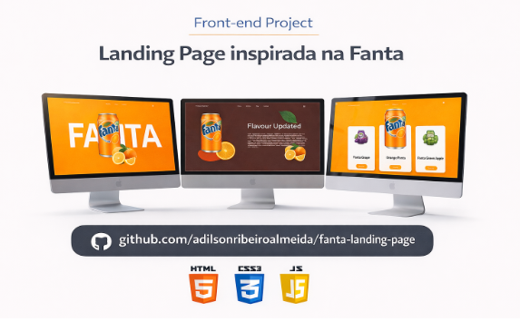

# 🍊 Fanta Landing Page

Projeto de landing page inspirado na marca **Fanta**, desenvolvido com foco em **layout moderno**, **UI design** e **responsividade**.

## 📸 Preview
<p align="center">
  
</p>
## 🚀 Tecnologias utilizadas
- HTML5
- CSS3
- JavaScript
- Flexbox
- Design responsivo

## 🎯 Objetivo do projeto
Praticar:
- Estruturação semântica
- Posicionamento de elementos
- Design moderno para landing pages
- Organização de código front-end

## 🖥️ Como executar
```bash
git clone https://adilsonribeiroalmeida.github.io/fanta-landing-page/
cd fanta-landing-page
